# Raquel Barros 👩🏻‍💻

<div align="center">
  
</div> 


## Sobre Mim




## Info

```java
public class Desenvolvedora {
    private String nome = "Raquel Barros";
    private String localizacao = "Tianguá, CE - Brasil 🇧🇷";
    private String cargo = "Estagiária em Desenvolvimento de Sistemas";
    private String formacao = "EEEP Professor Sebastião Vasconcelos Sobrinho";
    private String[] foco = {
        "Desenvolvimento Back-End com Java e Spring Boot",
        "Construção e consumo de APIs RESTful",
        "Modelagem de dados e Banco de Dados MySQL",
        "Resolução de problemas e aprendizado contínuo"
    };
    private String objetivo = "Buscando ingressar na área de TI para me tornar uma profissional " +
                             "referência, contribuindo para a inovação tecnológica no Brasil.";
}
```

>Estudante de Desenvolvimento de Sistemas pela EEEP Professor Sebastião Vasconcelos Sobrinho (Tianguá/CE). Foco em construção de soluções eficientes, aprendizado contínuo e aperfeiçoamento no ecossistema Java e Spring Boot.

---


<div align="center">
<table>
<tr><td align="center">

<b> Back-end e Database</b>

</td></tr>
<tr><td align="center">

&nbsp;
&nbsp;
&nbsp;
&nbsp;


</td></tr>
<tr><td align="center">

<b> Front-end, Ferramentas e IDEs</b>

</td></tr>
<tr><td align="center">

&nbsp;
&nbsp;
&nbsp;
&nbsp;
&nbsp;
&nbsp;
&nbsp;


</td></tr>
</table>
</div>

---


### Estatísticas de Código
<p align="left">
  
  
</p>

---

<picture>
  <source media="(prefers-color-scheme: dark)" srcset="https://raw.githubusercontent.com/Eduardarf15/Eduardarf15/output/snake-dark.svg" />
  <source media="(prefers-color-scheme: light)" srcset="https://raw.githubusercontent.com/Eduardarf15/Eduardarf15/output/snake.svg" />
  
</picture>

---

<p align="center">
  <b>Estou disponível para troca de ideias e colaboração em projetos inovadores!💜
</b>
  
</p>

<p align="center">
  <a href="https://linkedin.com/in/raquel-barros-828b68334" target="_blank"></a> 
  <a href="mailto:raquelbrrs07@gmail.com" target="_blank"></a>
</p>
